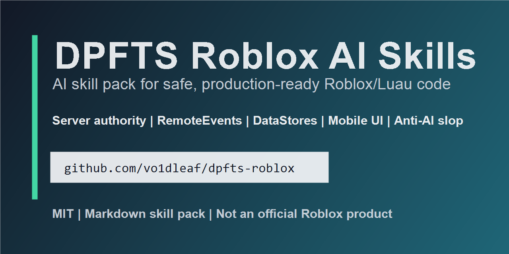

# DPFTS Roblox AI Skills



**DPFTS publicly stands for Developer's Plugin For Total Savings.** It is an AI skill pack that teaches coding assistants to write safe, practical, production-ready Roblox and Luau code.

DPFTS is built for Roblox developers who use AI tools but do not want client-trusting RemoteEvents, broken DataStores, messy UI, giant scripts, or generic simulator sludge.

Install this skill: github.com/timasigmapro228/dpfts-roblox

## Why This Exists

AI assistants can write Roblox code that looks confident and still ships bad architecture:

- The client tells the server it has `99999` coins.
- A LocalScript grants rewards or badges.
- DataStores save without `pcall`, validation, or defaults.
- Shop UI says "Purchased" before the server confirms anything.
- A map is huge, empty, and impossible to read on mobile.

DPFTS gives the assistant stronger Roblox instincts: server authority, clean Luau, clear Studio placement, mobile-first UI, safer monetization, practical testing, and anti-AI-slop design review.

## Install: Pick Your Tool

DPFTS is just Markdown. That is the point: you can use it with Claude Code, Claude.ai Projects, Codex, Cursor, Windsurf, or almost any AI assistant that accepts custom instructions.

### Claude Code

Install DPFTS as a Claude Code skill.

Windows PowerShell:

```powershell
git clone https://github.com/timasigmapro228/dpfts-roblox.git "$env:USERPROFILE\.claude\skills\dpfts"
```

macOS/Linux:

```bash
git clone https://github.com/timasigmapro228/dpfts-roblox.git ~/.claude/skills/dpfts
```

Then restart Claude Code and ask:

```text
Use DPFTS to review this Roblox RemoteEvent for exploit risks.
```

### Claude.ai Web/Desktop Projects

Claude.ai Projects do not use your local skill folder.

1. Create or open a Project.
2. Add `SKILL.md` to Project Knowledge.
3. Add the `core/`, `deep/`, and `recipes/` Markdown files if you want Claude to reference the full pack.
4. Start prompts with `Use DPFTS...`.

### Codex

Install DPFTS as a local Codex skill.

Windows PowerShell:

```powershell
git clone https://github.com/timasigmapro228/dpfts-roblox.git "$env:USERPROFILE\.codex\skills\dpfts"
```

macOS/Linux:

```bash
git clone https://github.com/timasigmapro228/dpfts-roblox.git ~/.codex/skills/dpfts
```

### Cursor, Windsurf, And Other AI IDEs

These tools may not read `SKILL.md` automatically.

Use the universal route:

1. Open `SKILL.md`.
2. Copy its contents into your project rules file, such as `.cursorrules`, `.windsurfrules`, or your IDE's custom instructions area.
3. Keep the `core/`, `deep/`, and `recipes/` folders in the repo so the assistant can reference them when you paste or attach files.

### Universal Fallback

If your assistant supports custom instructions, system prompts, project memory, or uploaded knowledge files:

1. Open `SKILL.md`.
2. Paste it into the assistant's custom instructions or system prompt.
3. Attach or paste deeper files only when relevant.
4. Prompt with `Use DPFTS...`.

## First Prompt

Ask your assistant for Roblox work with DPFTS enabled:

```text
Use DPFTS to build a server-authoritative coin shop with clean Luau and testing steps.
```

## Check The Output

A good DPFTS answer should include:

- Roblox Studio placement.
- Server/client separation.
- Clean Luau code.
- RemoteEvent validation.
- DataStore safety when persistence is involved.
- Testing steps and common failure cases.

## Before And After

### Without DPFTS

```lua
-- ServerScriptService/BadShop.server.lua
BuyItem.OnServerEvent:Connect(function(player, itemId, price)
    player.leaderstats.Coins.Value -= price
    giveItem(player, itemId)
end)
```

Problem: the client can send any `itemId` and any `price`, including `-99999`.

### With DPFTS

```lua
-- ServerScriptService/ShopService.server.lua
BuyItem.OnServerEvent:Connect(function(player, itemId)
    if typeof(itemId) ~= "string" then
        return
    end

    local item = ShopConfig.Items[itemId]
    if not item then
        return
    end

    local profile = Profiles[player]
    if not profile or profile.Coins < item.Price then
        return
    end

    if profile.Inventory[itemId] then
        return
    end

    profile.Coins -= item.Price
    profile.Inventory[itemId] = true
    BuyResult:FireClient(player, true, itemId, profile.Coins)
end)
```

Better: the client requests an action, the server owns price, currency, inventory, validation, and the final result.

More examples: [examples/BEFORE_AFTER.md](examples/BEFORE_AFTER.md)

Icon workflow: [examples/GVESSTER_ICON_WORKFLOW.md](examples/GVESSTER_ICON_WORKFLOW.md)

## What It Helps With

- **Security:** RemoteEvents, permissions, exploit review, admin tools, purchases, and server authority.
- **Code quality:** Luau style, ModuleScripts, project structure, testing, debugging, and release checks.
- **Persistence:** DataStores, save slots, schema validation, autosave, failure handling, and `BindToClose`.
- **Game systems:** shops, inventory, quests, daily rewards, leaderboards, trading, rounds, pets, parties, teleports, badges, and codes.
- **Design:** mobile UI, buttons, Gvesster Free Icon Pack guidance, hubs, maps, thumbnails, first 30 seconds, tutorials, and anti-AI-slop reviews.
- **Production:** performance, live ops, observability, analytics, rollback thinking, changelogs, and launch checklists.

## Strong Example Prompts

- "Use DPFTS to review this RemoteEvent system like an exploiter would."
- "Use DPFTS to build a server-authoritative shop that cannot trust client prices."
- "Use DPFTS to design a DataStore profile for Coins, Level, Inventory, and Settings."
- "Use DPFTS to review my Roblox place layout and tell me what feels like AI slop."
- "Use DPFTS to design mobile-friendly Roblox buttons for my shop UI."
- "Use DPFTS to debug why my shop works in Play Solo but fails with two clients."
- "Use DPFTS to review whether this Roblox update is ready to publish."
- "Use DPFTS to create a security audit checklist before I release trading."

More prompts: [examples/PROMPTS.md](examples/PROMPTS.md)

## Repository Map

The short version:

- `SKILL.md`: main AI-facing instruction file.
- `core/`: identity, Luau style, and design rules.
- `deep/`: focused guides for security, DataStores, remotes, UI, performance, economy, debugging, release readiness, and more.
- `recipes/`: ready-to-use patterns for common Roblox systems.
- `examples/`: prompt examples and before/after examples.

Full file map: [STRUCTURE.md](STRUCTURE.md)

## v1.0 Status

DPFTS v1.0 is the first stable, releasable version of the skill pack. It is ready to use as a practical Roblox AI guidance pack, with MIT licensing, release notes, contribution guidance, issue templates, examples, and a cleaner GitHub landing page.

It is not an official Roblox product. It does not install scripts into Roblox Studio automatically. It does not replace testing in Studio. It gives your AI assistant better Roblox judgment.

## Contributing

Recipes, corrections, and better Roblox patterns are welcome. Start with [CONTRIBUTING.md](CONTRIBUTING.md).

## License

MIT. See [LICENSE](LICENSE).

If DPFTS saves you time or stops your AI assistant from shipping exploit-friendly Roblox code, star the repo.
